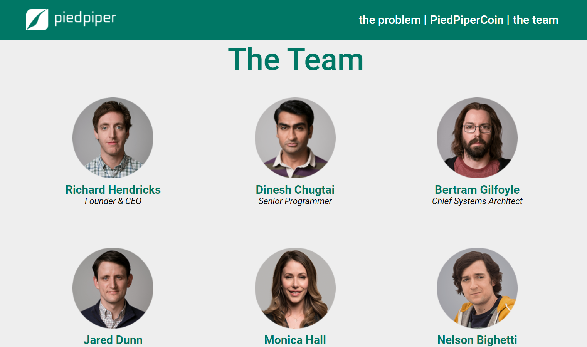

# Домашнее задание Stepik - Pied Piper

Это решение задания с курса "Веб-разработка для начинающих: HTML и CSS" (https://stepik.org/course/38218/info).  
Впервые верстала лендинг, поэтому могут быть ошибки. Однако с ними интереснее :)

## Содержание

- [Обзор](#обзор)
  - [Требования](#требования)
  - [Скриншот](#скриншот)
  - [Ссылки](#ссылки)

## Обзор

Ты попал на работу в успешный технологический стартап. С тобой в команде работают крутые технари, лучшие в своём деле. Чтобы привлечь инвесторов и рассказать о компании, нужно сверстать лендинг - превратить нарисованный макет в рабочую страничку на HTML и CSS.

### Требования

1. Шапка остаётся вверху экрана при прокручивании страницы.
2. Контент вложен в блок, ширина которого жёстко задана и равна 1219px, боковые padding'и - по 55px.
3. Клик по ссылкам в шапке должен переносить на соответствующие разделы страницы. При клике на лого должен происходить переход в самый верх страницы.
4. Контент внутри секций должен быть выровнен по центру, чтобы на больших экранах он не прилипал к правому краю.
5. Лучше избегать установки width и height вручную. Исключение - картинки и фиксированный контейнер страницы.
6. Свойство position можно задать только для шапки.  
7. ___Дополнительно от меня:___ _сверстать страницу без использования flex._

### Скриншот

### Ссылки

- URL-адрес решения: [Github](https://github.com/kris-mkv/pied-piper)
- URL-адрес живого сайта: [Github Page](https://kris-mkv.github.io/pied-piper/)
- Макет в Фигме: [Макет](https://www.figma.com/file/BL7wdCOSIxYFu1uxctuVzg/%D0%94%D0%BE%D0%BC%D0%B0%D1%88%D0%BD%D0%B5%D0%B5-%D0%B7%D0%B0%D0%B4%D0%B0%D0%BD%D0%B8%D0%B5-Pied-Piper)
